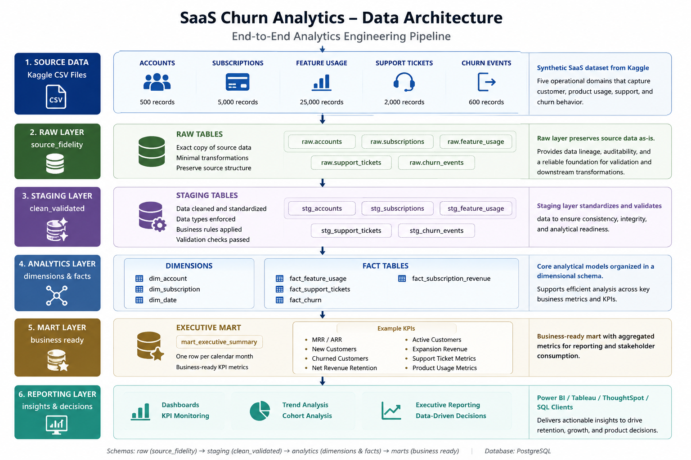

# SaaS Analytics Engineering Project (PostgreSQL)

## Project Overview

This project simulates an end-to-end Analytics Engineering workflow using PostgreSQL. The objective is to transform raw SaaS operational data into trusted, business-ready analytical models that support reporting, business intelligence, and decision-making.

The project covers the complete analytics engineering lifecycle, including source data ingestion, data quality validation, transformation, dimensional modeling, KPI development, analytical mart creation, documentation, and version control.

---

## Business Objective

The project models a fictional SaaS company's operational data to support analysis across:

- Customer growth
- Subscription lifecycle
- Product engagement
- Customer support performance
- Customer churn
- Recurring revenue

The final analytics layer provides reusable dimensions, fact tables, and a monthly executive summary mart designed to support executive reporting and ad-hoc business analysis.

---

## Key Deliverables

- Built a layered PostgreSQL architecture across `raw`, `staging`, and `analytics` schemas.
- Ingested and validated 33,100 records across five operational datasets.
- Performed primary key, foreign key, null, categorical, numeric, and temporal data quality validation.
- Developed reusable customer, subscription, feature usage, support, churn, revenue, and date models.
- Defined and validated business KPIs against source data before incorporating them into downstream reporting.
- Built a monthly executive summary mart covering customer growth, subscription churn, product usage, support performance, and recurring revenue.
- Documented data limitations and adjusted KPI definitions when source data did not reliably support the intended business metric.

---

## Technology Stack

- PostgreSQL
- SQL
- Git & GitHub
- Markdown Documentation

### Potential Future Enhancements

- Power BI or Tableau executive dashboard
- Python-based data automation
- dbt implementation

---

## Project Architecture

For detailed table relationships and analytical modeling, see the [Data Model Documentation](docs/03_data_model.md).
