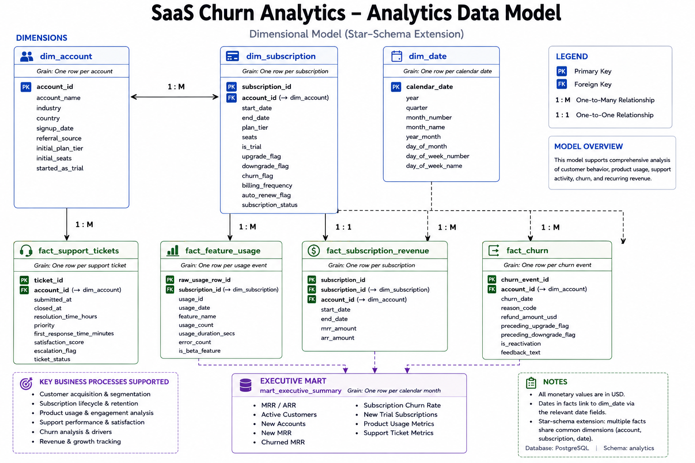

# Logical Data Model

## Overview

The RavenStack SaaS dataset models the core operational entities involved in managing customer subscriptions, product usage, customer support, and churn events.

The relational model captures the relationships between these business processes while maintaining normalized transactional data suitable for downstream analytical modeling.

This document defines the logical data model used throughout the project, including table grain, primary and foreign keys, relationship cardinality, and modeling considerations.

---

## Analytics Data Model

The analytics layer uses dimensional modeling to organize account, subscription, product usage, support, churn, and recurring revenue data for downstream analysis.

---

# Table Overview

## Accounts

**Grain**

One row per unique account.

**Primary Key**

`account_id`

**Role**

Core business entity representing a customer.

**Relationships**

- One account → many subscriptions
- One account → many support tickets
- One account → zero or more churn events

---

## Subscriptions

**Grain**

One row per unique subscription.

**Primary Key**

`subscription_id`

**Foreign Key**

`account_id` → Accounts

**Role**

Revenue-generating entity tied to a customer.

**Relationships**

- Many subscriptions → one account
- One subscription → many feature usage events

**Dataset Note**

Although subscriptions contain a `churn_flag`, the dataset models detailed churn history separately through the `churn_events` table at the account level.

---

## Feature Usage

**Grain**

One row per source record in `feature_usage.csv`.

**Primary Key**

`raw_usage_row_id` (surrogate key)

**Business Identifier**

`usage_id`

**Foreign Key**

`subscription_id` → Subscriptions

**Role**

Behavioral telemetry capturing customer engagement with the SaaS platform.

**Relationships**

- Many usage events → one subscription

---

## Support Tickets

**Grain**

One row per unique support ticket.

**Primary Key**

`ticket_id`

**Foreign Key**

`account_id` → Accounts

**Role**

Customer support interactions and service quality metrics.

**Relationships**

- Many support tickets → one account

---

## Churn Events

**Grain**

One row per unique churn event.

**Primary Key**

`churn_event_id`

**Foreign Key**

`account_id` → Accounts

**Role**

Records churn events associated with an account, including churn timing, reason, financial impact, and reactivation history.

**Relationships**

- Many churn events → one account

---

# Relationship Summary

| Parent | Child | Cardinality |
| --- | --- | --- |
| Accounts | Subscriptions | One-to-Many |
| Accounts | Support Tickets | One-to-Many |
| Accounts | Churn Events | One-to-Zero-or-Many |
| Subscriptions | Feature Usage | One-to-Many |

---

# Modeling Considerations

## Churn Modeling

During the initial modeling phase, an alternative design was considered where detailed churn would be represented entirely at the subscription level.

Subscriptions already contain lifecycle attributes such as `start_date`, `end_date`, and `churn_flag`, which provide the appropriate basis for measuring subscription termination.

However, the source dataset separately models detailed churn-event history at the account level through the `churn_events` table.

To preserve source fidelity, the project retains both concepts:

- subscription lifecycle termination is measured using subscription-level fields;
- detailed churn-event context remains associated with accounts through `churn_events`.

This distinction became important when developing downstream churn KPIs because an account with churn activity may still maintain other active subscriptions.

---

## Feature Usage Identifier

During raw data ingestion, duplicate values were identified in the source `usage_id` field despite the dataset documentation describing it as unique.

To preserve every source record:

- the original `usage_id` was retained as a business identifier;
- a surrogate key (`raw_usage_row_id`) was introduced within PostgreSQL;
- both identifiers were retained through downstream staging and analytics models.

---

# Analytics Implementation

The source-oriented logical model was extended downstream into a dimensional analytics layer consisting of:

- `analytics.dim_account`
- `analytics.dim_subscription`
- `analytics.dim_date`
- `analytics.fact_feature_usage`
- `analytics.fact_support_tickets`
- `analytics.fact_churn`
- `analytics.fact_subscription_revenue`
- `analytics.mart_executive_summary`

The analytical model preserves the relevant source relationships while reorganizing the data around reusable business entities, measurable events, and executive-level reporting requirements.
